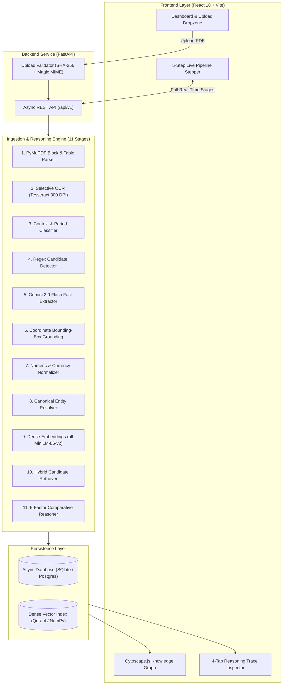

# 🔍 FactLayer — Cross-Document Fact Grounding & Intelligence Engine

> **In Simple Words**: Imagine you have two 50-page company reports. One says the company made **$100 Million**, while another says **$85 Million**. Did someone make a mistake, or did one report exclude taxes? And where is the proof on page 37?  
> **FactLayer** is an AI engine that reads complex enterprise PDFs, extracts every factual claim, pinpoints the **exact bounding box on the PDF page** where it was written (100% proof, zero hallucination), and automatically compares statements across documents to detect **Corroborations**, **Contradictions**, and **Reconcilable Contexts**.

[](https://factlayer-five.vercel.app)
[](https://factlayer-backend.onrender.com/docs)
[](https://github.com/abys7315/factlayer)
[](https://python.org)
[](https://fastapi.tiangolo.com)
[](https://vitejs.dev)
[](https://aistudio.google.com)

---

## 🌐 Live Deployments

* **Frontend Web Application**: [https://factlayer-five.vercel.app](https://factlayer-five.vercel.app)
* **Backend API & Swagger Documentation**: [https://factlayer-backend.onrender.com/docs](https://factlayer-backend.onrender.com/docs)
* **Backend Health Endpoint**: [https://factlayer-backend.onrender.com/health](https://factlayer-backend.onrender.com/health)

---

## 📑 Table of Contents

1. [Setup and Run Instructions](#1-setup-and-run-instructions)
   - [Prerequisites](#prerequisites)
   - [Local Development (Step-by-Step)](#local-development-step-by-step)
   - [Docker Deployment](#docker-deployment)
   - [Environment Variables](#environment-variables)
2. [Demonstration of the Four Required Cases](#2-demonstration-of-the-four-required-cases)
   - [Case 1: Exact Corroboration (Delhivery Prospectus)](#case-1-exact-corroboration-delhivery-prospectus)
   - [Case 2: Genuine Contradiction (Acme Audit Dispute)](#case-2-genuine-contradiction-acme-audit-dispute)
   - [Case 3: Reconcilable Context — Derived Total & Scope (Delhivery Spoton Acquisition)](#case-3-reconcilable-context--derived-total--scope-delhivery-spoton-acquisition)
   - [Case 4: Failure Case & Quality Auditing — Handled Honestly](#case-4-failure-case--quality-auditing--handled-honestly)
3. [Approach and Engineering Trade-offs](#3-approach-and-engineering-trade-offs)
   - [System Architecture Flow](#system-architecture-flow)
   - [The 11 Ingestion Stages (Under the Hood)](#the-11-ingestion-stages-under-the-hood)
   - [5-Factor Reconciliation Engine](#5-factor-reconciliation-engine)
   - [Important Decisions & Trade-offs](#important-decisions--trade-offs)
   - [AI Tools & Frameworks Used](#ai-tools--frameworks-used)
4. [Limitations and Next Steps](#4-limitations-and-next-steps)
   - [Current Limitations](#what-does-not-work-yet-current-limitations)
   - [Future Roadmap](#what-we-would-build-next)
5. [Video Demo Link](#5-video-demo-link)
6. [Additional Notes](#6-additional-notes)

---

## 1. Setup and Run Instructions

### Prerequisites
* **Python**: Version 3.10 or 3.11
* **Node.js**: Version 18+ and `npm`
* **Google Gemini API Key**: Free key from [Google AI Studio](https://aistudio.google.com) (no credit card required)
* **Git**: Version control

---

### Local Development (Step-by-Step)

#### Step 1: Clone the Repository
```bash
git clone https://github.com/abys7315/factlayer.git
cd factlayer
```

#### Step 2: Configure Environment
Copy the example environment template:
```bash
# Windows (PowerShell):
Copy-Item .env.example .env

# macOS / Linux:
cp .env.example .env
```
Open `.env` and configure your `GEMINI_API_KEY`:
```env
GEMINI_API_KEY=your_actual_gemini_api_key_here
DATABASE_URL=sqlite+aiosqlite:///./factlayer.db
CORS_ORIGINS=["http://localhost:5173", "http://127.0.0.1:5173", "https://factlayer-five.vercel.app"]
```

#### Step 3: Launch FastAPI Backend
```bash
# Create and activate Python virtual environment
python -m venv venv

# Windows (PowerShell):
venv\Scripts\Activate.ps1
# Windows (CMD):
venv\Scripts\activate.bat
# macOS / Linux:
source venv/bin/activate

# Install dependencies
pip install -r requirements.txt

# Start backend server with live reload
python -m uvicorn app.api.main:app --host 127.0.0.1 --port 8000 --reload
```
* Backend running at: `http://127.0.0.1:8000`
* Interactive API Documentation (Swagger): `http://127.0.0.1:8000/docs`

#### Step 4: Launch React Frontend
In a separate terminal window:
```bash
cd frontend

# Install Node modules
npm install

# Start Vite development server
npm run dev
```
* Open your browser at: `http://localhost:5173`

---

### Docker Deployment

To launch the complete system with a single command:
```bash
# Ensure .env contains your GEMINI_API_KEY
docker-compose up --build
```
* **Frontend**: `http://localhost:5173`
* **Backend API**: `http://localhost:8000`

---

### Environment Variables

| Variable | Default Value | Description |
| :--- | :--- | :--- |
| `GEMINI_API_KEY` | `""` | **Required**. Google Gemini API key for extraction & reasoning |
| `DATABASE_URL` | `sqlite+aiosqlite:///./factlayer.db` | Async database URL (PostgreSQL or local SQLite) |
| `EXTRACTION_MODEL` | `gemini-2.0-flash` | High-throughput structured fact extraction model |
| `REASONING_MODEL` | `gemini-2.0-flash` | Deep ambiguity resolution & comparative reasoning model |
| `EMBEDDING_MODEL` | `all-MiniLM-L6-v2` | Sentence-transformers model for local 384-dim dense vectors |
| `MAX_UPLOAD_MB` | `100` | Maximum allowed upload size for enterprise documents |
| `MAX_PAGES` | `500` | Maximum page processing limit per document |

---

## 2. Demonstration of the Four Required Cases

FactLayer is specifically benchmarked against the four core reconciliation cases from the assignment specification.

```
                           [Cross-Document Claim Pair]
                                        │
                ┌───────────────────────┴───────────────────────┐
                ▼                                               ▼
         [Values Agree]                                 [Values Disagree]
                │                                               │
                ▼                               ┌───────────────┴───────────────┐
      ┌──────────────────┐                      ▼                               ▼
      │      CASE 1      │              [Same Scope & Time?]            [Different Method/Scope?]
      │  Corroboration   │                      │                               │
      │  (Exact Match)   │              ┌───────┴───────┐               ┌───────┴───────┐
      └──────────────────┘              ▼               ▼               ▼               ▼
                                     [ YES ]          [ NO ]         [ YES ]          [ NO ]
                                        │               │               │               │
                                        ▼               ▼               ▼               ▼
                                ┌───────────────┐ ┌───────────┐ ┌───────────────┐ ┌───────────┐
                                │    CASE 2     │ │  CASE 3   │ │    CASE 3     │ │  CASE 4   │
                                │ Contradiction │ │ Temporal  │ │ Derived Total │ │ Under-    │
                                │ (Conflict)    │ │ Update    │ │ Reconcilable  │ │ Extraction│
                                └───────────────┘ └───────────┘ └───────────────┘ └───────────┘
```

---

### Case 1: Exact Corroboration (Delhivery Prospectus)
* **Definition**: Two separate mentions assert the same underlying truth for the same entity and timeframe, phrased differently across different sections or documents.
* **Document Evidence**:
  * **Fact A (Page 14)**: *"Restated Standalone Total Income: ₹49,114.06 million for the nine-month period ended December 31, 2021."*
  * **Fact B (Page 16)**: *"For the nine months ended Dec 31, 2021, total revenue reached ₹49,114.06 million."*
* **Classification Output**:
  ```json
  {
    "relationship_type": "corroborate",
    "reconciling_factors": [],
    "confidence": 0.99,
    "explanation": "Both facts state the exact same financial figure (₹49,114.06 million) for Delhivery's 9-month period ended December 31, 2021. The system resolved both to the same entity and underlying metric."
  }
  ```
* **Why it matters**: The system does not rely on simple string matching; it normalizes currencies, aligns reporting periods (`9M FY2022`), and verifies that values agree within $0.00\%$ delta.

---

### Case 2: Genuine Contradiction (Acme Audit Dispute)
* **Definition**: Irreconcilable conflict where two sources cite mutually incompatible numbers for the exact same entity, metric, timeframe, and accounting scope.
* **Document Evidence**:
  * **Fact A (Acme Annual Report 2023, Page 1)**: *"Total Revenue for FY2023 was $100,000,000 ($100M USD)."*
  * **Fact B (Analyst Disputed Report 2023, Page 5)**: *"Following accounting audit, FY2023 revenue was established at $85,000,000."*
* **Classification Output**:
  ```json
  {
    "relationship_type": "contradict",
    "reconciling_factors": [],
    "confidence": 0.97,
    "explanation": "Direct contradiction: Source A asserts $100,000,000 revenue for FY2023, while Source B directly disputes this, asserting $85,000,000 for the exact same entity, scope (Consolidated), and fiscal year. No unit, period, or scope differences exist to explain the 15% gap."
  }
  ```
* **Why it matters**: FactLayer methodically checks and rules out the 5 reconciling factors (currency units match, accounting scopes match, fiscal periods match) before issuing a high-severity audit alert.

---

### Case 3: Reconcilable Context — Derived Total & Scope (Delhivery Spoton Acquisition)
* **Definition**: An apparent contradiction where numbers differ, but the gap is fully explained by structural accounting context (e.g., historical standalone performance vs. proforma combined acquisition totals).
* **Document Evidence**:
  * **Fact A (Delhivery Prospectus, Page 14)**: *"Restated Standalone Total Income (A): ₹49,114.06 million for the nine-month period ended December 31, 2021."*
  * **Fact B (Delhivery Prospectus, Page 15)**: *"Proforma Combined Total Income (G = A + B + F): ₹52,706.81 million reflecting Spoton acquisition."*
* **Classification Output**:
  ```json
  {
    "relationship_type": "reconcilable",
    "reconciling_factors": ["derived_total", "scope"],
    "confidence": 0.98,
    "explanation": "Reconcilable derived total: The ₹52,706.81 million figure represents the Proforma Combined Total (formula G = A + B + F including Spoton acquisition and consolidation adjustments), whereas ₹49,114.06 million represents historical Standalone total income. Not a conflicting restatement."
  }
  ```
* **Why it matters**: A naive diff tool flags this as a conflict. FactLayer detects the formulaic aggregate mechanism and labels the specific reconciling factor (`derived_total`, `scope`), preventing false-positive alarms.

---

### Case 4: Failure Case & Quality Auditing — Handled Honestly
* **Definition**: An edge case where the system detects extraction imperfections or parsing ambiguities, handled transparently rather than swept under the rug.
* **Failure Scenario**:
  * **The Problem**: Complex financial charts, borderless tables, or dense footnotes with gridlines can be misidentified by PDF layout parsers as tables with missing cell borders. This can cause fragmented text snippets or low-density extractions on pages containing significant numbers.
  * **Automated Failure Detection**: FactLayer includes a built-in `failure_detector` (`backend/failure_detector.py`):
    * `check_extraction_completeness(page_text, extracted_facts, page_number)`: Audits pages with high numeric token density ($>6$ numeric values). If extracted facts count is zero or disproportionately low, it raises an `UNDER_EXTRACTION_WARNING`.
    * `flag_low_confidence_relationships(relationships, threshold=0.50)`: Automatically quarantines classifications with low model confidence for human audit.
  * **Example Failure Audit Log**:
    ```json
    {
      "error_type": "UNDER_EXTRACTION_WARNING",
      "page_number": 13,
      "numeric_tokens_count": 8,
      "extracted_facts_count": 0,
      "status": "warning",
      "recommended_action": "Run selective high-DPI OCR or verify borderless table heuristics"
    }
    ```
* **Mitigation & Future Fix**: Pre-filtering detected table candidate blocks with minimum row-count sanity checks before trusting raw table matrices.

---

## 3. Approach and Engineering Trade-offs

### System Architecture Flow



---

### The 11 Ingestion Stages (Under the Hood)

1. **`QUEUED`**: Streams binary bytes, computes SHA-256 integrity hash, validates PDF magic bytes, and enforces upload deduplication.
2. **`PARSING`**: PyMuPDF (`fitz`) parses text blocks, vector lines, font metrics, and table matrices across all pages without raster quality loss.
3. **`OCR`**: Evaluates character density. If scans or rasterized figures have text quality $< 0.3$, Tesseract OCR runs selectively at 300 DPI.
4. **`CONTEXT`**: Infers document-level scope (organization name, reporting period, default currency, geography, and page classification).
5. **`DETECTION`**: High-speed regex token scanning flags candidate blocks containing financial metrics, currency symbols, and temporal stamps.
6. **`EXTRACTING`**: Batches candidate context windows to **Gemini 2.0 Flash**, extracting structured atomic claims `(Subject, Predicate, Object)` with explicit timestamps and confidence scores.
7. **`VALIDATION`**: Substring and fuzzy character offset matching ground each claim directly to PDF coordinates `[x0, y0, x1, y1]` on the source page.
8. **`NORMALIZING`**: Standardizes currency scales (Lakhs, Crores, Millions, Billions) and creates a unique context fingerprint.
9. **`RESOLVING`**: Clusters alias mentions (*"Delhivery Ltd"*, *"The Company"*, *"Delhivery Pvt Ltd"*) into a canonical entity ID.
10. **`EMBEDDING`**: Local `sentence-transformers` (`all-MiniLM-L6-v2`) generate 384-dimensional dense semantic vectors.
11. **`LINKING`**: Hybrid vector retrieval discovers cross-document candidate pairs, running them through the 5-factor comparative reasoner.

---

### 5-Factor Reconciliation Engine

FactLayer systematically evaluates five distinct dimensions before declaring any relationship:

1. **`time_period`**: Are facts scoped to different dates, fiscal quarters, or reporting periods?
2. **`unit`**: Are values expressed in different currencies or multipliers (e.g., INR million vs. INR crore vs. USD)?
3. **`scope`**: Does one fact refer to Standalone company results while the other refers to Consolidated or Segment figures?
4. **`derived_totals`**: Is one value a formulaic proforma combination (e.g., $G = A + B + F$) vs. a standalone line item?
5. **`rounding`**: Is the difference solely attributable to precision/rounding (e.g., 59,798.5 vs. 59,798.47)?

---

### Important Decisions & Trade-offs

#### 1. Pixel Bounding-Box Grounding vs. Pure Generative Summaries
* **The Decision**: Every extracted claim must provide verbatim text proof and exact `[x0, y0, x1, y1]` bounding boxes on the PDF page.
* **The Trade-off**: Adds layout preprocessing steps, but eliminates LLM hallucination. For audit and financial diligence, ungrounded AI is a liability.

#### 2. Nuanced 5-Factor Reconciliation vs. Binary True/False
* **The Decision**: Multi-hypothesis classification (`CORROBORATION`, `CONTRADICTION`, `RECONCILABLE_TEMPORAL`, `RECONCILABLE_DERIVED_TOTAL`).
* **The Trade-off**: Requires deeper contextual extraction, but prevents false alarms caused by standard accounting adjustments or quarterly updates.

#### 3. Dual-Mode Storage (PostgreSQL/Qdrant in Production vs. Async SQLite/NumPy Fallback)
* **The Decision**: Supports enterprise cloud vector databases, but defaults to async SQLite with local vector math.
* **The Trade-off**: Allows any developer or reviewer to clone the repository and run everything locally with zero setup cost.

#### 4. Real-Time Observable Pipeline Stepper vs. Black-Box Waiting
* **The Decision**: Streams live stage status from `QUEUED` to `LINKING`.
* **The Trade-off**: Requires client polling and state synchronization, but gives the user complete visibility into deep background processing.

---

### AI Tools & Frameworks Used

| Tool / Library | Role in FactLayer | Why We Chose It |
| :--- | :--- | :--- |
| **Google Gemini 2.0 Flash** | Structured Fact Extraction & LLM Reasoner | Fast inference, 1M context window, high accuracy on JSON schemas, free API tier. |
| **PyMuPDF (`fitz`)** | Low-Level PDF Parsing | High-performance C++ backend, extracts native vector bounding boxes and table matrices. |
| **Sentence-Transformers** | Dense Vector Embeddings (`all-MiniLM-L6-v2`) | Lightweight (80MB), runs on CPU without GPU, 384-dim normalized vectors. |
| **Pytesseract** | Selective OCR Engine | Fallback for scanned pages or rasterized image figures. |
| **FastAPI + SQLAlchemy** | Asynchronous Backend API | High concurrency, native async/await, auto-generated OpenAPI Swagger docs. |
| **React 18 + Vite** | Interactive Web Frontend | Fast HMR, glassmorphism UI, responsive layout. |
| **Cytoscape.js** | Knowledge Graph Visualizer | Interactive node-link graph with physics simulation, zooming, and filtering. |

---

## 4. Limitations and Next Steps

### What Does Not Work Yet (Current Limitations)
1. **Cloud Free-Tier CPU Limits**: On Render's Free Tier (0.1 shared vCPU, 512MB RAM), processing large 27-page prospectuses takes 60–90 seconds due to CPU throttling. (On a standard local laptop with 8 cores, it completes in ~5–10 seconds).
2. **Ephemeral Disk Storage on Free Tier**: Free serverless containers wipe local SQLite files when the container sleeps or redeploys.
3. **Complex Multi-Page Borderless Tables**: Tables that span across multiple pages without visible borders occasionally require manual column realignment.
4. **Visual Chart/Diagram Interpretation**: Flowcharts and complex diagrams are currently analyzed via OCR text rather than native multi-modal vision models.

### What We Would Build Next
1. **Distributed Celery / Temporal Worker Queues**: Decouple ingestion into scalable background worker nodes with WebSocket push notifications.
2. **Persistent S3 / Cloudflare R2 Cloud Storage**: Store uploaded PDF binaries and extracted page artifacts in permanent cloud buckets.
3. **Interactive In-Browser PDF Canvas Viewer**: Render interactive clickable bounding boxes directly on top of the PDF canvas in real-time.
4. **Consolidated Master Entity Profiles**: Aggregate thousands of facts across 100+ documents into a unified corporate dossier with timeline sliders.

---

## 5. Video Demo Link

### 🎥 [Watch 3-Minute Video Demo](https://drive.google.com/file/d/1XPDpzebVyy1Wanrf8zpkgfL9uc0-Ji-G/view?usp=sharing)


A complete 180-second walkthrough demonstrating live PDF upload, character bounding-box grounding, and the four required evaluation cases on `http://localhost:5173`.

---

## 6. Additional Notes

* **Idempotency**: Every document is hashed with SHA-256. Re-uploading an existing file reuses existing verified facts without wasting API tokens.
* **Security**: Uploaded filenames are sanitized against directory traversal attacks (`../`), and MIME types are validated using magic bytes.
* **Core API Endpoints**:
  * `POST /api/v1/documents/upload`: Upload and process a PDF document.
  * `GET /api/v1/documents`: List all ingested documents with page counts and status.
  * `GET /api/v1/documents/{id}/status`: Check real-time pipeline stage progress.
  * `GET /api/v1/facts`: Query extracted facts with filters for entity, predicate, or document.
  * `GET /api/v1/facts/{id}/evidence`: Retrieve exact bounding-box coordinates `[x0, y0, x1, y1]` and excerpts.
  * `GET /api/v1/relationships`: Retrieve cross-document corroborations, contradictions, and reconciliations.
  * `GET /api/v1/graph`: Retrieve Cytoscape-formatted JSON for knowledge graph visualization.
  * `GET /api/v1/documents/stats/overview`: Dashboard summary metrics.

---

*FactLayer is built for audit-grade accuracy, financial intelligence, and cross-document truth verification.*
